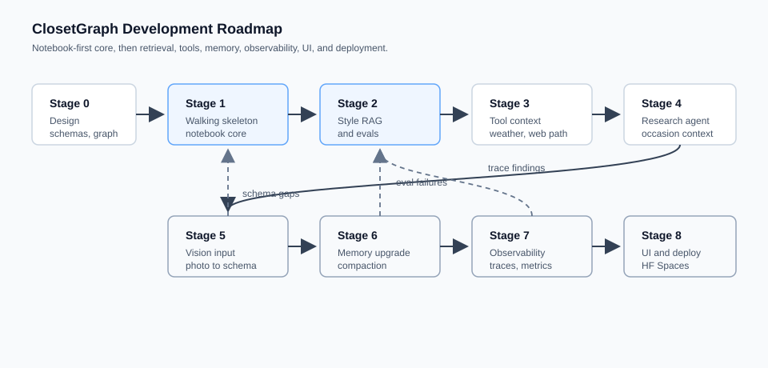

# ClosetGraph: Roadmap

ClosetGraph is a multi-agent LangGraph system for turning a persistent personal wardrobe into ranked, occasion-appropriate outfits. The core challenge is compositional styling: the system should judge complete outfits, not just label individual items as casual, work, or formal.

The first build target is a notebook-based core system. Each stage should be independently demoable. If the project stops after any stage, what exists should still work.



Solid arrows show the intended build order. Dashed arrows show likely feedback loops.

## Product Principle

ClosetGraph must reason through this chain:

```text
individual garments
        |
layering combination
        |
  complete outfit
        |
effective formality
        |
occasion suitability
        |
     ranking
```

An item's appropriateness can change based on the full outfit. A tank can become business casual under a blazer with tailored trousers. A sheer top may need an opaque base layer and structured outer layer. Dark clean jeans may work for some business-casual contexts but should rank below tailored trousers for a conservative client meeting.

The system should treat dress codes as ranges:

```text
casual -> smart casual -> business casual -> professional/business -> formal
```

Some constraints can be deterministic, such as ownership checks and impossible combinations. Nuanced styling decisions should use retrieved style knowledge and model reasoning. We will decide together which logic belongs in structured code, RAG, or model judgment before implementing it.

## Architecture Boundaries

| Piece | Role | Type |
| --- | --- | --- |
| Supervisor | Routes the workflow, combines evidence, ranks final outfits | Agent or graph controller |
| Stylist | Reasons about outfit composition, occasion fit, and styling tradeoffs | Agent |
| Research | Looks up unfamiliar dress codes, venues, or occasion norms | Later agent |
| Wardrobe store | Persists owned items and attributes | Storage |
| Session memory | Tracks current conversation context | Memory |
| Memory compaction | Summarizes long sessions | Node or utility |
| Style guide | Retrieves styling principles from a custom corpus | RAG |
| Outfit generator | Creates candidate combinations from owned items | Deterministic or hybrid node |
| Outfit validator | Checks ownership and hard constraints | Deterministic node |
| Weather lookup | Adds weather context when useful | Tool |
| Vision classifier | Converts photos into proposed wardrobe items | Model-backed node |

## Stage 0: Design

- [ ] Define the first notebook workflow.
- [ ] Sketch LangGraph state and routing without coding.
- [ ] Choose minimal V1 wardrobe fields.
- [ ] List later rich attributes: formality range, layering role, opacity, coverage, neckline, fit, silhouette, material, texture, color, pattern, and compatibility.
- [ ] Decide the first outfit request format.
- [ ] Draft 5 to 10 tricky styling examples for evaluation.
- [ ] Decide what is deterministic in V1 versus judged by the stylist model.

**Done when:** the core graph, state objects, and styling responsibilities can be explained clearly before implementation begins.

## Stage 1: Walking Skeleton

- [ ] Text-only wardrobe entry.
- [ ] Simple local persistence for wardrobe data.
- [ ] LangGraph workflow with explicit state.
- [ ] Supervisor connected to Stylist.
- [ ] Candidate outfit generation from owned items only.
- [ ] Deterministic ownership validation.
- [ ] Ranked outfit output with reasoning over complete outfits.
- [ ] Manual demo with a small real wardrobe and 3 occasions.

**Done when:** the notebook produces sensible, non-generic ranked outfits using only owned wardrobe items.

## Stage 2: Style Guide RAG and Evals

- [ ] Style-guide corpus outline created.
- [ ] Initial style-guide documents authored or provided.
- [ ] Chroma index built for style-guide retrieval.
- [ ] Retrieval connected to Stylist reasoning.
- [ ] Golden eval set covering ownership, layering, dress-code ranges, and ranking.
- [ ] Deterministic outfit-validity checker.
- [ ] First metrics recorded: validity rate, retrieval quality, latency, and common failure modes.

**Done when:** styling recommendations are grounded in retrieved guidance and evals expose clear strengths and failures.

## Stage 3: Tool Context

- [ ] Weather context added through a free source or user-provided input.
- [ ] Supervisor routing decides when weather is relevant.
- [ ] Browser or web lookup path designed for later research use.
- [ ] Tool failures degrade gracefully.
- [ ] Shopping kept out of the main recommendation loop unless used later for wardrobe gap analysis.

**Done when:** weather can visibly change an outfit ranking without breaking the owned-wardrobe constraint.

## Stage 4: Research Agent

- [ ] Research agent role defined separately from Stylist.
- [ ] Research used only for unfamiliar dress codes, venues, events, or ambiguous context.
- [ ] Search results summarized into styling-relevant constraints.
- [ ] Supervisor decides when research is needed.
- [ ] Sourced context feeds into Stylist and final ranking.

**Done when:** the system can explain why it interpreted an ambiguous occasion a certain way, using external context when appropriate.

## Stage 5: Vision Input

- [ ] Photo upload path planned.
- [ ] Free or local vision model option selected.
- [ ] Vision output maps into the same wardrobe schema as text entry.
- [ ] Confidence and uncertainty surfaced to the user.
- [ ] User confirmation required before photo-derived items enter persistent wardrobe memory.

**Done when:** photo-entered and text-entered wardrobe items are indistinguishable downstream after confirmation.

## Stage 6: Memory Upgrade

- [ ] Wardrobe memory remains separate from session memory.
- [ ] Session memory supports sliding context.
- [ ] Summarization or compaction added for long conversations.
- [ ] Durable user preferences considered separately from transient session details.
- [ ] Token usage measured on long sessions.

**Done when:** long conversations stay within context limits without corrupting wardrobe data.

## Stage 7: Observability

- [ ] Langfuse tracing evaluated against the zero-budget constraint.
- [ ] Local logging fallback added if hosted tracing is not viable.
- [ ] Traces capture graph route, retrieved context, tool calls, model outputs, and validation failures.
- [ ] Eval runs are repeatable.
- [ ] Known regressions are documented.

**Done when:** a reviewer can inspect how an outfit recommendation was produced and how quality is measured.

## Stage 8: UI and Deployment

- [ ] Minimal app UI for wardrobe management and outfit requests.
- [ ] Results view shows ranked outfits, reasoning, and constraints.
- [ ] Demo wardrobe and walkthrough prepared.
- [ ] Hugging Face Spaces deployment planned.
- [ ] Storage migration path from local persistence to deployable Postgres-compatible storage documented.
- [ ] Secrets and provider fallbacks documented.

**Done when:** a stranger can use the deployed demo without needing a live explanation.

## Open Decisions Before Stage 1

- [ ] Notebook structure.
- [ ] Minimal wardrobe schema.
- [ ] Sample wardrobe items and edge cases.
- [ ] Outfit request shape.
- [ ] LangGraph state shape.
- [ ] Candidate generation strategy.
- [ ] Deterministic validation checks.
- [ ] Stylist output format.
- [ ] First evaluation examples.

## Portfolio Story

The final project should show:

- persistent personal wardrobe memory
- LangGraph orchestration
- justified multi-agent decomposition
- retrieval-grounded styling intelligence
- compositional outfit reasoning
- explicit evaluation of subjective recommendations
- free or local model strategy with Groq and Ollama
- staged growth from notebook prototype to deployable app

The strongest demo will show ClosetGraph handling a nuanced outfit decision where individual item labels are insufficient, then explaining why the top-ranked outfit works as a complete composition.
